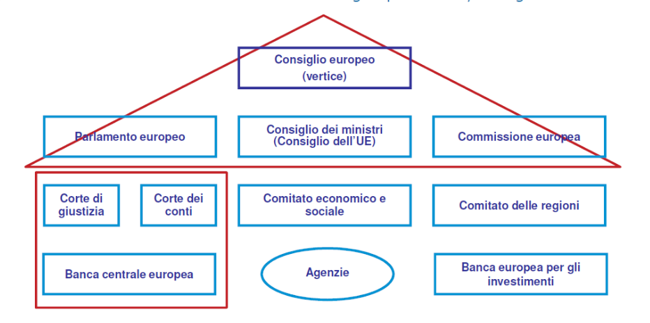
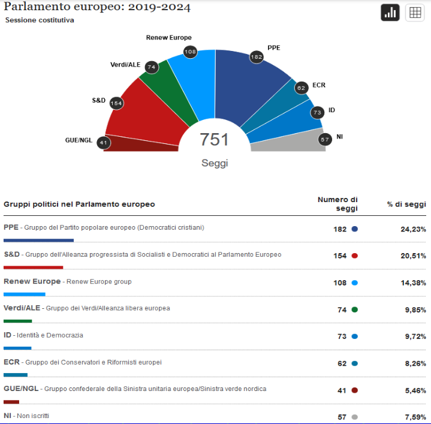

# Unione Europea
Organizzazione che riunisce molti paesi europei, allo scopo di promuoverne l'integrazione economica e politica, e favorire lo sviluppo economico e sociale dei loro cittadini

## Motto
Il motto "Unità nella Diversità" indica che tutti gli europei operano unitamente per la pace e la prosperità e che culture, tradizioni e lingue presenti in Europa costituiscono la sua ricchezza

## Le Istituzioni
Il trattato di Lisbona non modifica l'architetura istituzionale dell'UE, che resta fondata sul triangolo Parlamento, Consiglio e Commissione

### Parlamento Europeo
Composto da un massimo di 705 rappresentanti dei cittadini dell'Unione (più il presidente) ogni 5 anni

#### Condizioni
- Ha potere legislativo
- Approva il bilancio
- Controlla la Commissione

#### I Seggi del Parlamento Europeo (2019-2024)

#### Gruppi politici
I deputati non sono suddivisi in delegazioni nazionali, bensì in formazioni transnazionali costituite sulla base delle affinità politiche. A norma del regolamento, un gruppo politico deve essere composto da deputati eletti in almeno un quarto degli Stati membri e deve constare di almeno 25 deputati (articolo 33). I gruppi politici tengono riunioni regolari nel corso della settimana che precede la tornata e a margine della stessa, organizzano giornate di studio finalizzate a determinare i principi di base della propria attività. Alcuni gruppi politici corrispondono a partiti politici sovranazionali attivi a livello dell'Unione Europea

#### Sistema elettorale
A norma dell'Atto elettorale del 1976 modificato, l'elezione dei deputati al Parlamento
europeo avviene a scrutinio di lista o uninominale preferenziale con riporto di voti di tipo proporzionale. Gli Stati membri possono inoltre consentire il voto di preferenza.
Oltre alla soglia minima volontaria per l'attribuzione dei seggi, pari ad un massimo
del 5% dei voti validamente espressi a livello nazionale, le recenti modifiche all'Atto
elettorale del 1976, adottate mediante decisione (UE, Euratom) 2018/994 del Consiglio, stabiliscono una soglia minima obbligatoria compresa fra il 2 e il 5% per le circoscrizioni (compresi gli Stati membri a circoscrizione unica) con più di 35 seggi, negli Stati membri in cui è utilizzato lo scrutinio di lista. Gli Stati membri dovranno conformarsi a tali obblighi entro le elezioni del 2024.

#### Attività
In base ai trattati, il Parlamento organizza le sue attività autonomamente e approva il proprio regolamento interno a maggioranza dei deputati che lo compongono (articolo 232 TFUE).

Salvo diversamente stabilito dai trattati, il Parlamento europeo delibera a maggioranza dei suffragi espressi (articolo 231 TFUE). 

Il Parlamento stabilisce il proprio ordine del giorno per le tornate, che prevede principalmente l'adozione di relazioni preparate dalle commissioni parlamentari, interrogazioni alla Commissione e al Consiglio, dibattiti d'urgenza e dichiarazioni della Presidenza. Le riunioni di commissione e le sedute plenarie sono pubbliche e trasmesse sul web.

### Consiglio Dell'Unione Europea
Ministri degli Stati membri Competenti per materia
#### Condizioni
- Ha potere legislativo

### Consiglio Europeo
Capo di Stato e di governo
#### Condizioni
- Ha potere di indirizzo

### Commissione Europea
27 commissari nominati per 5 anni
#### Condizioni
- Ha potere esecutivo

### Corte di Giustizia
27 giudici nominati per 5 anni e 11 avvocati
#### Condizioni
- Ha potere giurisdizionale

## Il processo decisionale dell'UE
Le decisioni a livello dell'unione europea vengono prese da diverse istituzioni dell'UE, ossia:
- il Parlamento europeo
- il Consiglio dell'Unione europea
- la Commissione europea
normalmente la Commissione europea propone le nuove leggi dell'UE, mentre il Consiglio e il Parlamento hanno il compito di adottarle
<strong>le principali forme assunte dal diritto dell'UE sono le direttive e i regolamenti</strong>
### Direttive
Le direttive stabiliscono un obiettivo comune a tutti gli Stati membri, ma lasciano alle autorità nazionali la responsabilità di decidere riguardo alla forma e ai mezzi per raggiungerlo. Di norma, agli Stati membri sono concessi uno o due anni per attuare una direttiva
### Regolamenti
I regolamenti sono direttamente applicabili nell'intera UE appena entrano in vigore, senza ulteriori interventi da parte degli Stati membri

## Atti normativi dell'Unione Europea

### Trattati
Accordi che istituiscono norme internazionali; vincolano solo gli Stati firmatari

### Regolamenti Comunitari
Atti normativi a carattere generale dotati di immediata operatività;
prevalgono sulle leggi nazionali anteriori con essi incompatibili

### Direttive
Atti normativi a carattere generale che hanno l'effetto di vincolare gli Stati a raggiungere l'obiettivo individuato; mezzi e forme vengono adottati liberamente dai singoli stati
